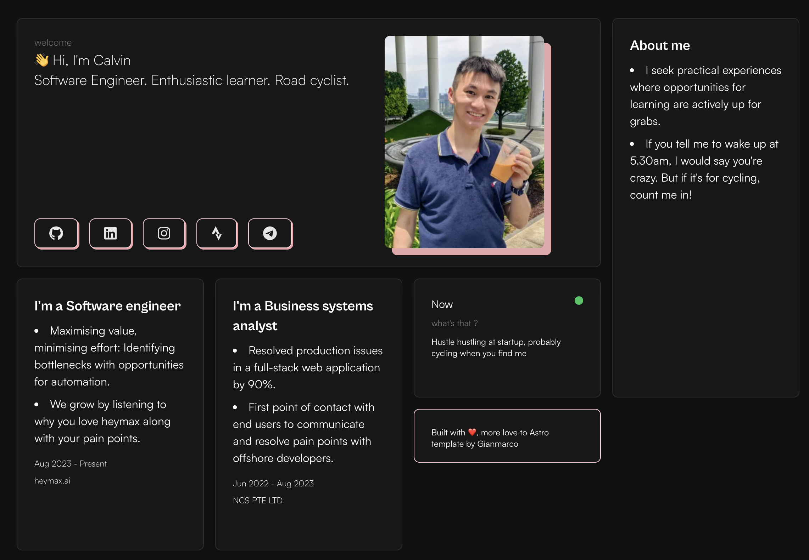

<!-- PROJECT LOGO -->
<br />
<p align="center">
  <h1 align="center">👋 Hi, I'm Calvin</h1>
</p>
<!-- PROJECT LOGO -->

[](https://github.com/calvindotsg/portfolio-v2/stargazers)
[](./LICENSE)
[](https://app.netlify.com/sites/calvindotsg/deploys)
[](https://github.com/calvindotsg/portfolio-v2/commits/main/)
[](https://github.com/calvindotsg/portfolio-v2/forks)

## A personal portfolio website made using `Astro`.



## Features

- Modern and Minimal bento-like, sleek UI Design
- All in one page
- Fully Responsive
- Performances and SEO optimizations
- Deployed on [Netlify](https://www.netlify.com/)

## Tech Stack

- [Astro](https://astro.build)
- [unocss](https://unocss.dev/)
- [motion](https://motion.dev/)
- [d3](https://d3js.org/)

# Steps ▶️

```bash
# Clone this repository
$ git clone https://github.com/Ladvace/astro-bento-portfolio
```

```bash
# Go into the repository
$ cd astro-bento-portfolio
```

```bash
# Install dependencies
$ pnpm install
or
$ npm install
```

```bash
# Start the project in development
$ pnpm run dev
or
$ npm run dev
```

# Configuration

1. Modify this portfolio web app with your data in `./components/lib/constants.ts`
2. 

# Deploy on Netlify 🚀

Deploying your website on Netlify

Simplify fork this repo and linking it to your Netlify account.

or

[](https://app.netlify.com/start/deploy?repository=https://github.com/calvindotsg/portfolio-v2)

## Contact
For any queries or discussions regarding the project, please open an issue in the repository.

## Sharing 💗

Project is open source. Feel free to make your own version. All you need to do is to fork this repository,
edit [/src/editable-stuff/config.js](./src/editable-stuff/config.js) and add resume. Mark star ⭐ if you like the project.

## Acknowledgement ❤️

This portfolio webapp [calvin.sg](https://calvin.sg) is a fork of the works of [Gianmarco](https://github.com/Ladvace)
