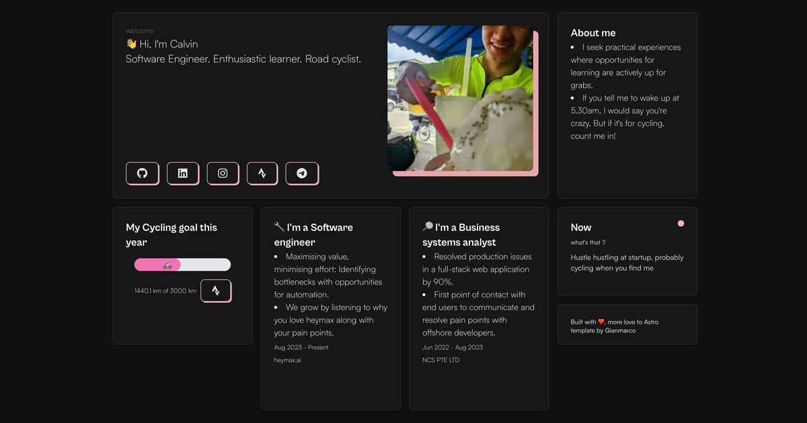

<!-- PROJECT LOGO -->
<br />
<p align="center">
  <h1 align="center">👋 Hi, I'm Calvin</h1>
</p>
<!-- PROJECT LOGO -->

[](https://github.com/calvindotsg/portfolio-v2/commits/main/)
[](./LICENSE)
[](https://app.netlify.com/sites/calvindotsg/deploys)
[](https://deepwiki.com/calvindotsg/portfolio-v2)

## Overview

A personal portfolio website built with [Astro](https://astro.build), showcasing my skills, projects, and interests.



## Features

- Bento-style, minimal, single-page design
- Fully responsive layout
- Dark/Light mode support
- Optimized for performance, accessibility, and SEO
- CI/CD integration with [Netlify](https://www.netlify.com/)

## Tech Stack

- [Astro](https://astro.build)
- [UnoCSS](https://unocss.dev/)
- [Iconify](https://iconify.design/) (Font Awesome 6 Brands + Remix Icon sets)
- [Umami](https://umami.is/)
- [Vitest](https://vitest.dev/)
- [Netlify](https://www.netlify.com/)

## Getting Started

1. Clone the repository:
   ```bash
   git clone https://github.com/calvindotsg/portfolio-v2
   ```

2. Navigate to the project directory:
   ```bash
   cd portfolio-v2
   ```

3. Install dependencies (this repo pins pnpm; `npm install` would ignore
   `pnpm-lock.yaml`):
   ```bash
   pnpm install
   ```

4. Copy the environment template — `UMAMI_ID` enables the analytics snippet and
   can be left as-is for local development:
   ```bash
   cp .env.example .env
   ```

5. Start the development server:
   ```bash
   pnpm dev
   ```

## Configuration

1. Update your personal details in `src/lib/constants.ts` — every piece of site
   content (links, career, about, cycling goal, footer, SEO metadata) lives
   there.
2. Modify the `site` and other relevant properties in `astro.config.mjs`.

## Testing

```bash
# Run the full suite once
pnpm test

# Re-run on change
pnpm test:watch
```

Three suites, all under `tests/`:

- `tests/rendered-html.test.ts` — renders `src/pages/index.astro` in-process with
  Astro's Container API and asserts on the result: page title, meta description,
  canonical link, the JSON-LD block, and that every entry in
  `src/lib/constants.ts` (welcome lines, about bullets, career entries, links,
  goal figures, footer) reaches the page.
- `tests/constants.test.ts` — data invariants for `src/lib/constants.ts`: link
  URLs are absolute or root-relative, icon names come from an installed Iconify
  collection, the cycling figures are finite and within range, and the SEO title
  and description stay within useful lengths.
- `tests/build-output.test.ts` — asserts on what `pnpm build` actually emits into
  `dist/`: `robots.txt` pointing at the sitemap, the sitemap index, exactly one
  stylesheet, and the public assets the page links to.

`pnpm test` runs `pnpm build` once as a global setup so the build-output suite
has real artifacts. Set `SKIP_BUILD=1` to reuse an existing `dist/` while
iterating.

## Deployment

### Deploy on Netlify

The site builds to a fully static `dist/` directory — no adapter, no serverless
function. Netlify's build command is `pnpm build` and its publish directory is
`dist`. To deploy your own copy:

1. Fork this repository.
2. Link the forked repo to your Netlify account.

Alternatively, deploy directly with this button:

[](https://app.netlify.com/start/deploy?repository=https://github.com/calvindotsg/portfolio-v2)

## Contact

For any questions or feedback, feel free to [open an issue](https://github.com/calvindotsg/portfolio-v2/issues) in the repository.

## Support 💗

- This project is open-source. Feel free to fork it and customize it with your details as described in the **Configuration** section.
- If you like the project, don't forget to star ⭐ the repository.

## Acknowledgements

This portfolio is inspired by [Gianmarco's work](https://github.com/Ladvace) and deployed at [calvin.sg](https://calvin.sg).