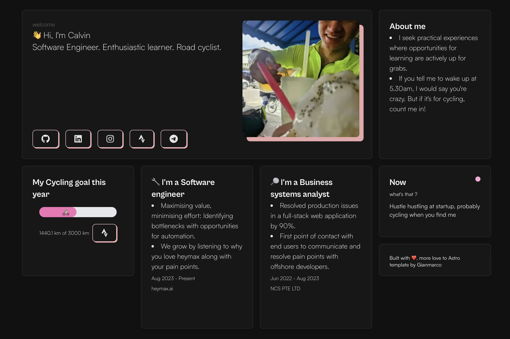

<!-- PROJECT LOGO -->
<br />
<p align="center">
  <h1 align="center">👋 Hi, I'm Calvin</h1>
</p>
<!-- PROJECT LOGO -->

[](https://github.com/calvindotsg/portfolio-v2/stargazers)
[](./LICENSE)
[](https://app.netlify.com/sites/calvindotsg/deploys)
[](https://github.com/calvindotsg/portfolio-v2/commits/main/)
[](https://github.com/calvindotsg/portfolio-v2/forks)

## Overview

A personal portfolio website built with [Astro](https://astro.build), showcasing my skills, projects, and interests.



## Features

- Bento-style, minimal, single-page design
- Fully responsive layout
- Dark/Light mode support
- Optimized for performance, accessibility, and SEO
- CI/CD integration with [Netlify](https://www.netlify.com/)

## Tech Stack

- [Astro](https://astro.build)
- [Svelte](https://svelte.dev/)
- [UnoCSS](https://unocss.dev/)
- [Motion](https://motion.dev/)
- [Font Awesome](https://fontawesome.com/)
- [Netlify](https://www.netlify.com/)

## Getting Started

1. Clone the repository:
   ```bash
   git clone https://github.com/calvindotsg/portfolio-v2
   ```

2. Navigate to the project directory:
   ```bash
   cd portfolio-v2
   ```

3. Install dependencies:
   ```bash
   npm install
   ```

4. Start the development server:
   ```bash
   npm run dev
   ```

## Configuration

1. Update your personal details in `./components/lib/constants.ts`.
2. Modify the `site` and other relevant properties in `astro.config.mjs`.

## Deployment

### Deploy on Netlify

To deploy on Netlify:

1. Fork this repository.
2. Link the forked repo to your Netlify account.

Alternatively, deploy directly with this button:

[](https://app.netlify.com/start/deploy?repository=https://github.com/calvindotsg/portfolio-v2)

## Contact

For any questions or feedback, feel free to [open an issue](https://github.com/calvindotsg/portfolio-v2/issues) in the repository.

## Support 💗

- This project is open-source. Feel free to fork it and customize it with your details as described in the **Configuration** section.
- If you like the project, don't forget to star ⭐ the repository.

## Acknowledgements

This portfolio is inspired by [Gianmarco's work](https://github.com/Ladvace) and deployed at [calvin.sg](https://calvin.sg).